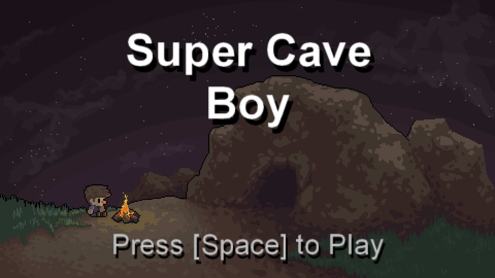
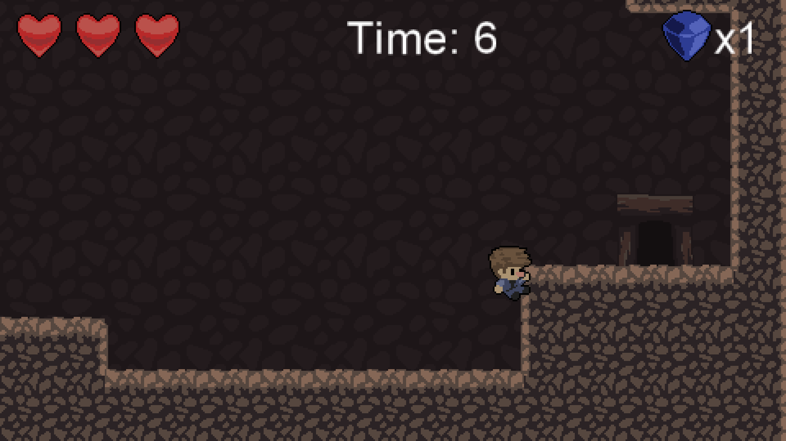
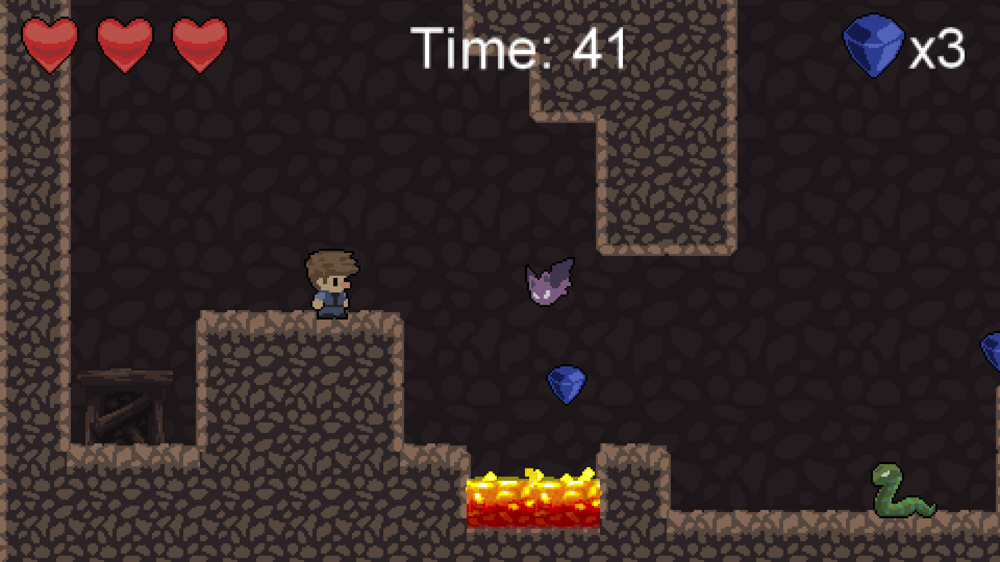

# CaveGame2D-GM
Game maker prototype game (made with 1.4)
Made with the assets and courses from Benjamin Anderson (https://twitter.com/uheartbeast)
[https://www.udemy.com/make-a-game-and-learn-to-code-in-gamemaker-studio/learn/v4/overview][1]

Project made with GameMaker 1.4.
The executable file is included in the final commit.

Here are a few examples of what I'm trying to achieve with this project :
> **Creating a 2D platformer game like "Super Meat Boy"/"The End is Nigh" :** 

> **Grab the ledge of a platform like the game "The end is nigh"** 

> **Fight against vicious enemies (IA behaviour unique for each enemy)**

